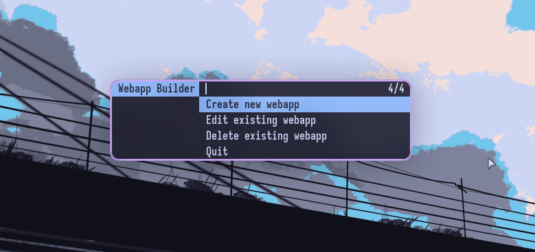

# webappman



`webappman` is a simple bash script for creating, editing, and deleting webapps. A webapp is a shell script that launches a specific URL in Brave Browser's app mode. This allows you to have "applications" for your favorite websites that are isolated from your main browser window.

`webappman` can be run in two modes:

*   **Terminal mode:** A command-line interface for managing your webapps.
*   **dmenu mode:** A graphical interface using `dmenu` for managing your webapps.

## Installation

1.  **Place the script in your `~/.local/bin` directory:**

    ```bash
    mv webappman ~/.local/bin/
    ```

2.  **Make the script executable:**

    ```bash
    chmod +x ~/.local/bin/webappman
    ```

3.  **Add the webapps directory to your shell's PATH.**

    The script creates a `~/.local/bin/webapps` directory to store the webapp launcher scripts. You need to add this directory to your PATH so you can run your webapps from the command line.

    For example, if you use fish shell, add the following to your `~/.config/fish/config.fish`:

    ```fish
    set -p PATH "$HOME/.local/bin/webapps" $PATH
    ```

    If you use bash, add the following to your `~/.bashrc` or `~/.bash_profile`:

    ```bash
    export PATH="$HOME/.local/bin/webapps:$PATH"
    ```

4.  **Restart your shell or source your shell's configuration file.**

    ```bash
    source ~/.config/fish/config.fish
    ```

    or

    ```bash
    source ~/.bashrc
    ```

## Usage

### dmenu Mode (Default)

To run `webappman` in `dmenu` mode, simply run the script without any arguments:

```bash
webappman
```

This will open a `dmenu` prompt with the following options:

*   **Create new webapp:** Prompts you to enter a URL and a name for the new webapp.
*   **Edit existing webapp:** Shows you a list of your existing webapps and allows you to edit the URL and name of the selected webapp.
*   **Delete existing webapp:** Shows you a list of your existing webapps and allows you to delete the selected webapp.
*   **Quit:** Exits the script.

### Terminal Mode

To run `webappman` in terminal mode, use the `--cli` flag:

```bash
webappman --cli
```

This will open a terminal menu with the same options as the `dmenu` mode.

### Running a Webapp

Once you have created a webapp, you can run it from the command line by typing its name:

```bash
gmail
```

This will launch the Gmail webapp in a new Brave Browser window.

## Dependencies

*   **Brave Browser:** The script is hardcoded to use `brave-browser-stable`. If you use a different browser, you will need to edit the script.
*   **dmenu (optional):** Required for `dmenu` mode.
*   **libnotify (optional):** Required for notifications in `dmenu` mode.
